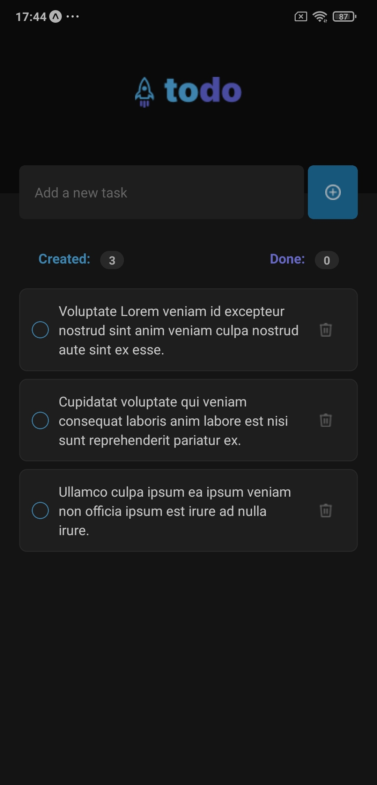
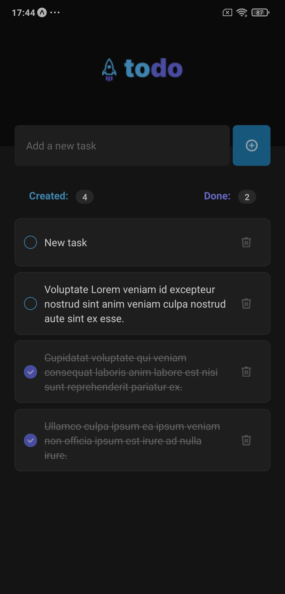

# React Native Task Manager

This is a simple task manager app built with React Native. It is dedicated to exploring and experimenting with the latest features and capabilities offered by the new versions of React Native and Expo in the managed workflow. 

## Features

- Add new tasks
- Mark tasks as done
- Delete tasks
- View summary of tasks

## Installation

To install the dependencies, run:

```bash
npm install
```

## Running the App
To start the app, run:

```bash
npm start
```

## Screenshots

<p float="left">
  
   
</p>

## Contributing

Pull requests are welcome. For major changes, please open an issue first to discuss what you would like to change.

## License

[MIT](https://choosealicense.com/licenses/mit)

